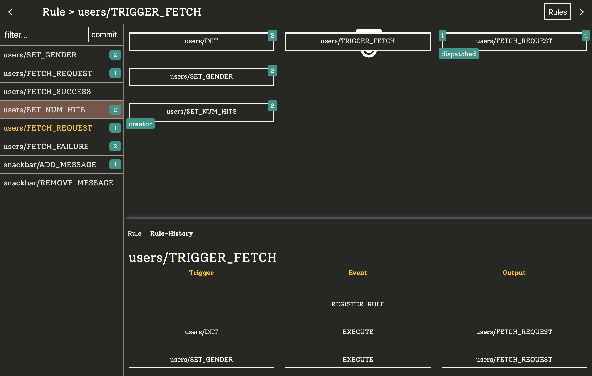
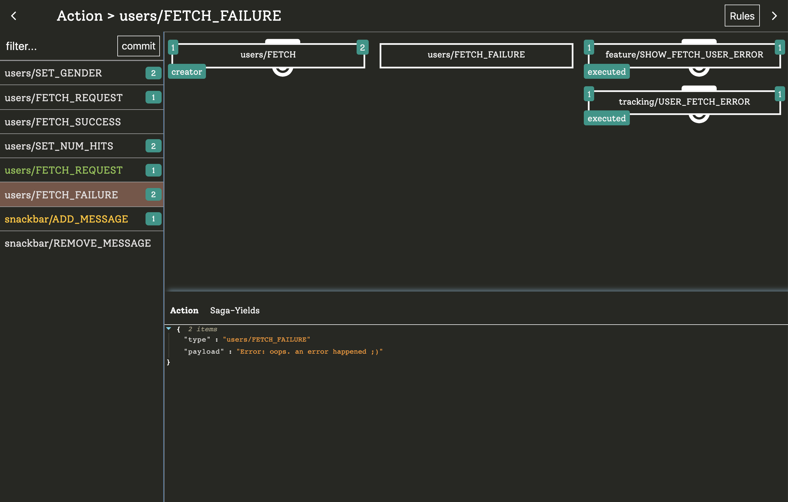
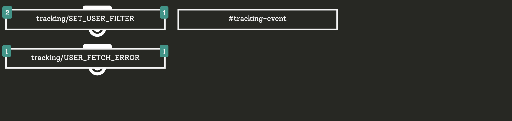

# Devtools

*The devtools are currently under development. If you encounter a bug, please write an [issue](https://github.com/manuelJung/ruleset-devtools/issues)*

Currently [devtools](https://chrome.google.com/webstore/detail/redux-ruleset/diibnbdfcjddnpmlhakebmiabmhhmnii) are only available for google chrome


Redux comes with really awesome devtools that gives deep insight what happens. But you cannot see why something happens or (more important) why something does not happen. That's where redux-ruleset devtools can help. Since every rule acts like a own little programm within your app, we can model relations between actions and rules:





To work best each rule should have another key `output`:

```javascript
import {addRule} from 'redux-ruleset'

addRule({
  id: 'PING_PONG',
  target: 'PING',
  output: 'PONG',
  consequence: () => ({type:'PONG})
})

addRule({
  id: 'FETCH',
  target: 'FETCH_REQUEST',
  output: ['FETCH_SUCCESS', 'FETCH_FAILURE'],
  concurrency: 'SWITCH',
  consequence: () => api.fetch().then(
    result => ({type: 'FETCH_SUCCESS', result}),
    error => ({type: 'FETCH_FAILURE', error})
  )
})
```

That way devtools can model exactly how rules and actions are related.
Even if a rule does not output a redux action you should also add an output that describes what happens within your consequence. I would recommend to prefix these "actions" with `#`:

```javascript
import {addRule} from 'redux-ruleset'

addRule({
  id: 'tracking/USER_FETCH_ERROR',
  target: 'users/FETCH_FAILURE',
  output: '#tracking-event',
  consequence: action => {
    analytics.sendEvent({
      type: 'error',
      message: action.error
    })
  }
})
```



The devtools will be able to visually present anything that happens in your rules. That includes:

- rule-lifetimes
- rule executions
- state-events
- actions
- connections between different actions
- connections between rules
- cancelations
- action manipulations
- concurrency
- ...

When you model your dataflow exclusivly with `redux-ruleset` you will be able to visualize ANYTHING that happens in your app. That is a gold-mine for debugging. 

Currently I'm working on a demo application that shows what can be done in the devtools. So for now, just learn how it works by your own