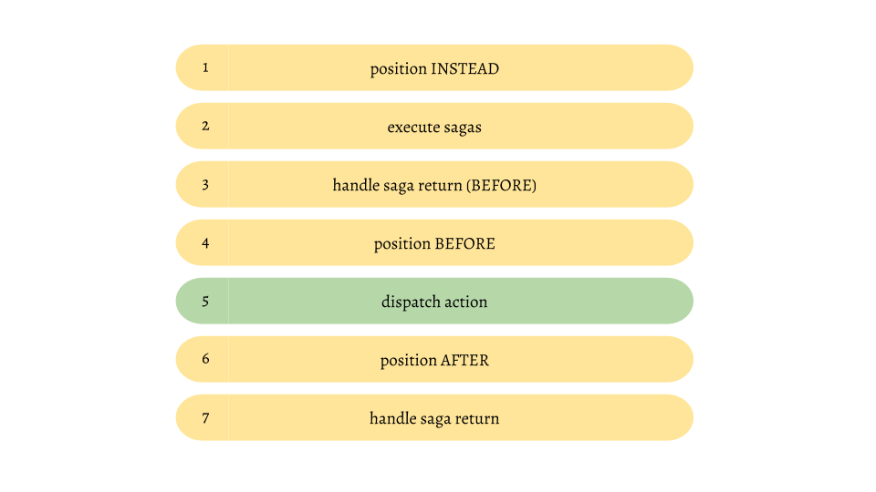

# How it works

If you followed the documentation to this point you've read a lot of different concepts. sagas, positions, consequences... but it's still very magic. Why doesn't reach an action the saga of one rule when another rule reacts to the same action and has a `position` *INSTEAD*? You can only answer such questions when you understand, how this middleware works. So let's try to disenchant the whole thing. 
This is an optional chapter. That means that you can use this middleware without deeply understanding the magic, but I like to understand the things I'm using so I'll try my best to explain it.

There are only two concepts that are important to understand. Sagas (`addWhen` and `addUntil` generators) and the `position` key. That are the only concepts that react to anything and the order of execution is very important here. When you return `ADD_RULE_BEFORE` in the `addWhen` saga, the rule will be added before the action happens, so that the rule itself can react to the very same action. To understand how this works you have to understand the execution order.

When you dispatch an action it won't reach your reducers instantly. The first thing that happens is that the action is passed through all middlewares. So the `redux-ruleset` middleware will get the action before your reducers. 

Every action that goes through this middleware has to pass several steps. The following is a simplified version of this steps:

**1)** The very first thing that happens is that we check if there is a active rule with `position`*INSTEAD* that reacts to the incomming action. If the rule's condition matches and the rule's consequence doesn't return an action with the same type we will skip everything else. Otherwise we will proceed with step 2. If there are multiple rules with position `INSTEAD` that could be executed only the first one will (all others will be skipped)

**2)** We check if there are currently any pending sagas that react to the current action. If so we yield this action to these sagas

**3)** If any of the sagas from step 2 returned a string of the `_BEFORE` family we execute the logic to this return type. E.g if a saga returned `ADD_RULE_BEFORE` we add the rule instantly and it will be considered in all further steps

**4)** We execute the consequences of all active rules with `position` *BEFORE* that listen to the current action and have a matching condtion

**5)** We dispatch the action. that means that the rule will be given to the next middleware and will reach your reducers to update the state. 

**6)** We execute the consequences of all active rules with `position` *AFTER* that listen to the current action and have a matching condtion

**7)** If any of the sagas from step 2 returned a string that is not in the `_BEFORE` family, we execute the logic to this return type. E.g if a saga returned `ADD_RULE` we add the rule so it can react to the next action

Well, that is not really complex, isn't it? Do not underestimate the complexity of this workflow. Everytime we execute a rule there is a chance, that this consequence dispatches one or more actions. That means that the whole cycle starts all over again before the current one has finished. In fact this is a gigantic nested recursion. Since consequences can also add or remove rules we cannot even be shure if the next rule is active any longer after the current one finishes the execution. Converting a linear stream of actions to a recursive one enables a bunch of cool new posibilities. And that is the true power of this middleware, hidden by a comparatively easy api where you never have to think about such things.