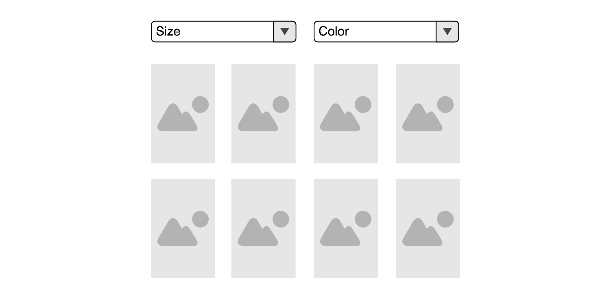

# Putting all together

So far so good. You've read about a lot of different concepts. State-Events, sagas, concurrencies, cancelation, rule-nesting... It's time to put all together. The following is a really complex example, so please read the docs again if anything is not clear enough.

### The Stage

We have a list of products. Each product has a size and we are able to filter our products by size. To do so the user can open up a dropdown to select one or multiple sizes:



We have products reducer that is responsible for holding the product list and managing the filters. This module exports an action-creator that can update the filters:

```javascript
const SET_FILTER = 'products/SET_FILTER'

const setFilter = (filterKey, filterValue) => ({
  type: SET_FILTER,
  meta: { filterKey },
  payload: filterValue
})
```

And we have a rule that fetches the new products whenever we set a filter:

```javascript
addRule({
  id: 'products/FETCH',
  target: FETCH_PRODUCTS_REQUEST,
  concurrency: 'SWITCH',
  consequence: ({getState}) => {
    const state = getState()
    const filters = getFilters(state.products)
    return api.fetchProducts(filters).then(
      result => actions.fetchProductsSuccess(result),
      error => actions.fetchProductsFailure(error)
    )
  }
})

addRule({
  id: 'products/TRIGGER_FETCH',
  target: [SET_FILTER, SET_PAGE, SET_CATEGORY],
  consequence: () => actions.fetchProductsRequest()
})
```

Our FilterDropdown:

```javascript
import {dispatchEvent} from 'redux-ruleset'

const FilterDropdown = ({ filterKey, filterValue, options }) => {
  return (
    <Dropdown
      onOpen={() => dispatchEvent({ type: 'FilterDropdown/OPEN', meta: {filterKey} })}
      onClose={() => dispatchEvent({ type: 'FilterDropdown/CLOSE', meta: {filterKey} })}
      activeValue={filterValue}
      options={options}
    />
  )
}
```

### Requirements

It is unneccessary to trigger a request while the user is still refining in the dropdown. So we only fetch when the the dropdown closes

- We do not want to trigger a request while the Dropdown is open
- When the user closes the dropdown without setting a filter we do not want to trigger a request
- As soon as the user sets one or multiple filters we trigger a request after the dropdown closes

### The rule

```javascript
import {addRule, skipRule} from 'redux-ruleset'
import * as productActions from 'modules/products/actions'

/*
When the user opens a filter-dropdown
Then we want to disable all product requests
and trigger one, as soon as the user refines and closes the dropdown
*/
addRule({
  id: 'feature/FETCH_ON_DROPDOWN_CLOSE',
  target: 'FilterDropdown/OPEN',
  consequence: ({addRule, action}) => {
    const {filterKey} = action.meta
    const removeOnDropdownClose = function* (next) {
      yield next('FilterDropdown/CLOSE')
      return 'REMOVE_RULE'
    }
    // abort request
    const abortRule = addRule({
      id: 'feature/FETCH_ON_DROPDOWN_CLOSE/PREVENT_SEARCH/' + filterKey,
      target: 'products/FETCH_REQUEST',
      position: 'INSTEAD',
      addUntil: removeOnDropdownClose,
      consequence: () => null
    })
    // trigger request after refinement
    addRule({
      id: 'feature/FETCH_ON_DROPDOWN_CLOSE/TRIGGER_SEARCH' + filterKey,
      target: 'FilterDropdown/CLOSE',
      addWhen: function* (next) {
        const action = yield next(['products/SET_FILTER', 'FilterDropdown/CLOSE'])
        if(action.type === 'products/SET_FILTER'){
          return 'ADD_RULE'
        }
        else return 'ABORT'
      },
      addUntil: removeOnDropdownClose,
      consequence: () => {
        const action = productActions.fetchProductsRequest()
        return skipRule(abortRule.id, action)
      }
    })
  }
})
```

Quite a few things happen here, so let's analyze this rule step by step. The `target` key tells us that this rule is invoked whenever a *FilterDropdown/OPEN* state action is dispatched. Then we want two things to happen:

- all `products/FETCH_REQUEST` actions should be discarded
- when the user refines, we want to fetch after the dropdown closes

To prevent all requests we add the *abortRule*. This rule listens to the `target` *products/FETCH_REQUEST* and totally throw it away (`position` *INSTEAD* and `consequence` returns null). That means that no *products/FETCH_REQUEST* will get dispatched as long as this rule is active. We will talk about the `addUntil` method later.

The next rule is resposible for fetching after the dropdown closes. The `addWhen` saga tells us, that we wait for two possible actions. If the user sets a filter we want to add the rule. If the user closes the dropdown we want to throw away the rule. This is important because otherwise the rule will wait in a pending status after the dropdown closes and the user did not set a filter.

When the second rule is added, it listens for the next *FilterDropdown/CLOSE* state event. As a consequence we will dispatch a product-request. Notice the `skipRule` wrapper. We skip the *abortRule* so the product-request actions will be dispatched and not thrown away by the *abortRule*.

Both rules use the same `addUntil` saga. The rules will be removed after the dropdown closes. You may ask yourself why we don't add the `addUntil` saga to the wrapper rule and return a *RECREATE_RULE* after the dropdown closes. Let's image the following scenario: The user opens the *color* dropdown sets a filter and clicks on the *size* dropdown. Now we would have the following actions:

- FilterDropdown/OPEN (color)
- products/SET_FILTER (color)
- FilterDropdown/OPEN (size)
- FilterDropdown/CLOSE (color)
- products/FETCH_REQUEST (color)

The *open* event of the size dropdown will come before the *close* event of the color dropdown. If we would handle the remove-logic in the `addUntil` saga of the root rule we would recreate the dropdown closes. Therefore the rule won't work for the size dropdown. This won't happen in the presented solution

<!-- ### Scenarios

I think the best way to understand this rule is to play through a few scenarios:

1) user opens color dropdown, sets a filter and closes the dropdown again
2) user opens color dropdown and closes it again
3) user opens color dropdown, sets a filter, opens size dropdown and closes it -->